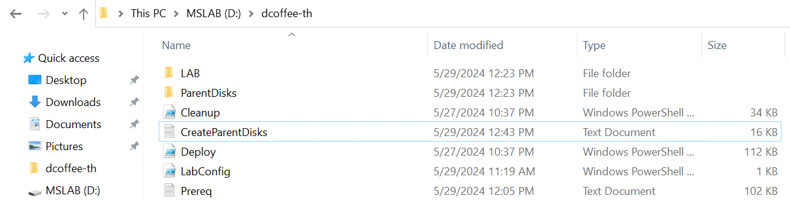

## 1. Hydrating MSLab Files

I am creating a folder with a dummy domain name I use throughout the Lab. After hydrating MSLab files, this folder will contain Domain Controller - ready to be imported and parent disks: Windows Server 2022 and Azure Stack HCI 23H2. 
Please note that the Domain controller here is unique to this Lab and can not be changed later (I use the specific Domain Name and also DC admin password). If you want to change domain name and password, you must re-hydrate MSLAB files again from fresh.

### Task 1 - Check hardware requirement

* I'm using a medium Hyper-V host VM with 16 vCPU and 48 GB of RAM. This time I only need to run DC, WAC, Management and MDT VMs not the actual Azure Stack HCI Nodes, because they will run as physical instead of nested VM.
* I'm also using Windows Server 2022 Datacenter Edition. This Hyper-V hosts will run a nested VM for azure stack HCI cluster nodes
* This Hyper-V host VM only have about 600GB, this should be enough since I'm not going to use nested Azure Stack HCI nodes VHDX here.
* THe Hyper-V Hosts will need to run somewhere outside of the physical AX nodes. In this Lab I'm using existing vSphere Cluster to run Hyper-V Host VM.

### Task 2 - Configure the Hyper-V Hosts VM from VSphere

#### Step 1 - Enable Nested Virtualization

Since we are running nested virtualization, we need to expose Hardware Assisted Virtualization to the Hyper-V Host VM on vSphere (I currently use vSphere here)


#### Step 2 - Enable Mac Address Spoofing

Since our nested VM require access to outside (e.g. internet) we need to enable MAC address spoofing. To do that in vSphere, edit te Port Group settings in Distributed Virtual Switch (DVS).


### Task 3 - Enable Hyper-V on the Hyper-V Hosts

Let's make sure we enable Hyper-V and Hyper-V management (GUI and PowerShell) on the Hyper-V host.

```powershell
$Result=Install-WindowsFeature -Name "Hyper-V" -ErrorAction SilentlyContinue
    if ($result.ExitCode -eq "failed"){
        Enable-WindowsOptionalFeature -FeatureName Microsoft-Hyper-V -Online -NoRestart 
    }
Install-WindowsFeature -Name "Hyper-V-Tools","Hyper-V-PowerShell"
```

### Task 4 - Download all neccessary files

* MSLab scripts : [MSLab](https://aka.ms/mslab) make sure you are using the latest (currently its v24.05.1)
* latest Windows Server ISO: [MSDN Download](https://my.visualstudio.com/downloads) requires Visual Studio users.
* latest Azure Stack HCI ISO: [23H2](https://azure.microsoft.com/en-us/products/azure-stack/hci/hci-download/) requires login to azure portal.

### Task 5 - Hydrate Lab

1. Unzip files from MSLab zip folder into C:\MSLAB

2. Replace content of LabConfig.ps1 with the following:
> Don't forget to add Admin and Password, We deliberately leave empty here for security purposes. Customize according to your environment.
```powershell
$LabConfig=@{ 
    DomainAdminName=''; 
    AdminPassword=''; 
    Prefix = 'dcoffee-' ; 
    DCEdition='4'; 
    Internet=$true ;
    DomainNetbiosName="th"; 
    DomainName="th.dcoffee.com";
    AdditionalNetworksConfig=@(); 
    VMs=@()
}
```
> This will create custom Domain Controller (AD) built on top of Windows Server Datacenter with GUI. Some explanation of the parameters are the following:

- **DomainAdminName** : used during 2_CreateParentDisks (no affect if changed after this step)
- **AdminPassword** : used 2_CreateParentDisks. If changed after, it will break the functionality of 3_Deploy.ps1
- **Prefix** : All VMs and vSwitch are created with this prefix, so you can identify the lab. If not specified, Lab folder name is use
- **DCEdition** : 4 for DataCenter or 3 for DataCenterCore. We want a full GUI for DC so we choose 4.
- **Internet** : if $true it will use External vSwitch from MSLAB Hyper-V hosts and create vNIC to the DC and configure NAT with some Open DNS servers in DNS forwarder (8.8.8.8 and 1.1.1.1)
> Note: Make sure you enable MAC address spoofing in MSLAB Hyper-V hosts, and you might want to setup static IP address for your DC if you are using static in your environment otherwise DHCP would also work. You also might need to add DNS forwarders using your environment DNS servers.
- **DomainNetbiosName** : custom NetBios will be used instead default "Corp"
- **DomainName** : custom DomainName will be used instead of default "Corp.Contoso.Com"
- **AdditionalNetworksConfig** : empty array for additional network config later (not used in this step)
- **VMs** : empty array for specifying Lab VMs (not used in this step)
3. Right-click 1_Prereq.ps1 and select **Run with PowerShell**, the script will automatically elevate and run as administrator
4. The script will finish. it will download necessary files and create folders. Close PowerShell Window by pressing enter.

5. Right-click 2_CreateParentDisks.ps1 and select **Run with PowerShell**.
6. When asked for ISO image, choose Windows Server 2022 image.
7. When asked for Windows Server Update (msu), click **cancel**
> Script will now create Domain Controller and Windows Server 2022 parent disks. It will take 15-30 minutes to finish. Once Finished, press Enter to close window (it will cleanup unnecessary files and folders).

### Expected Result

in MSLAB folder you should see LAB and ParentDisks folder along with three PowerShell scripts and log files.


### Task 6 - Create Azure Stack HCI parent disk

1. Navigate to MSLAB folder and open ParentDisks folder
2. Right-click on CreateParentDisk.ps1 and select **Run with PowerShell**
3. When asked for ISO image, choose Azure Stack HCI 23H2 image. Hit Cancel when asked for MSU package.
4. When asked for VHD name and size, just hit enter (it will use default AzSHCI23H2_G2.vhdx and 127GB size) 
> Script will finish in few minutes. When done, press enter to close PowerShell window. Azure Stack HCI image will be created.


### Expected Result

Azure Stack HCI 23H2 image will be created in ParentDisks folder. Hydrating is done