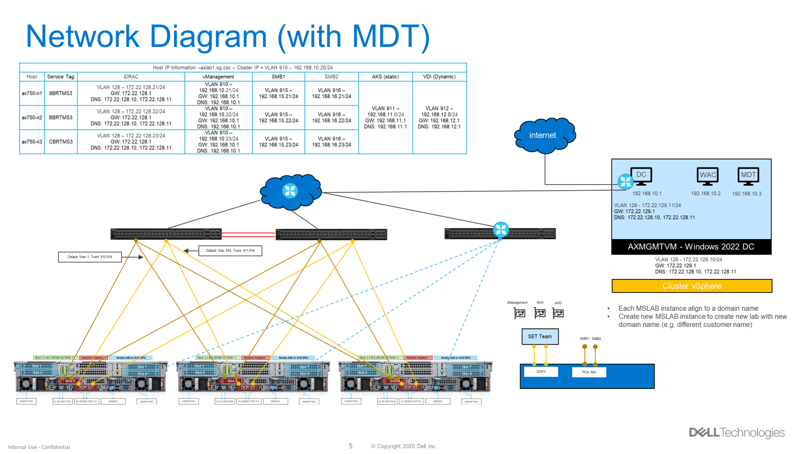
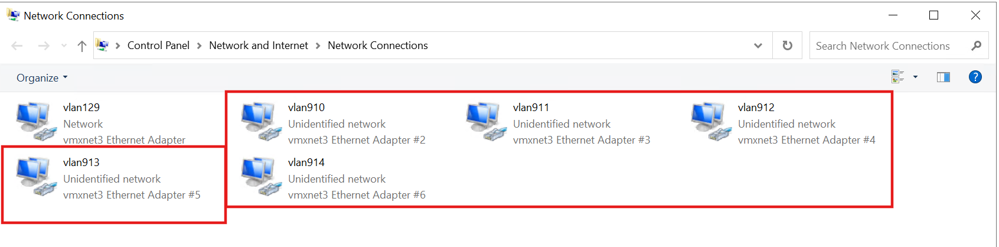

## 2. Deploy AX nodes with MSLab

Now we are going deploy AX nodes using MDT (Microsoft Deployment Toolkit)

### Task 1 - Setup required Network

This is the network diagram of the Lab:

### Task 2 - Deploy MSLab VMs

#### Step 1 - Identify NICs

Find the NICs on the Hyper-V hosts that are connected to AX nodes through the physical switches and Vsphere Distributed Switches like below example:

In this example we will select NICs with name vlan 910-914. Note vlan 129 is used to connect to internet.

